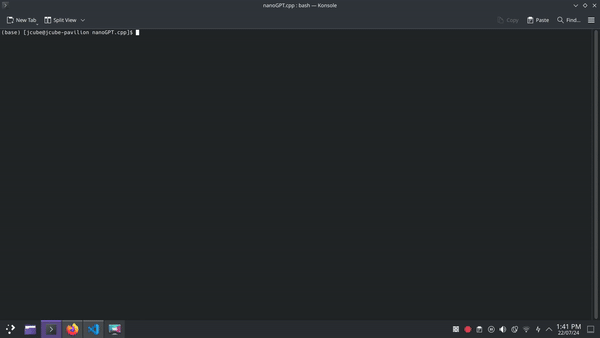

# Bigram Transformer

## Overview
The Bigram Transformer is a simple transformer model designed to predict the next character in a sequence based on a given context. It utilizes multi-head attention mechanisms to process and understand input sequences of up to 256 characters.

## Features
- Implements a transformer architecture with multi-head attention
- Predicts the next character based on contextual information
- Supports input sequences of up to 256 characters

## Technical Details
- **Model Architecture**: Transformer with multi-head attention
- **Input**: Character sequences (up to 256 characters)
- **Output**: Probability distribution over possible next characters
- **Training**: Trained on  WILLIAM SHAKESPEARE

## Installation
```bash
git clone https://github.com/jashjasani/nanogpt.git
cd nanogpt
pip install -r requirements.txt
```

## Usage
```python
from main import BiGramModel

model = BiGramModel()
model.load_state_dict(torch.load("./model.pt"))

x = torch.zeros((1,1), dtype=torch.long, device=device)
model.generate(x,5000)
```

## Configuration
You can customize the model's behavior by adjusting the following parameters:
- `n_head`: Number of attention heads
- `n_embd`: For number of embedding dimensions
- `n_layer`: Number of layers in parallel
- `max_sequence_length`: Maximum input sequence length (default: 256)


[](./bigram.gif)